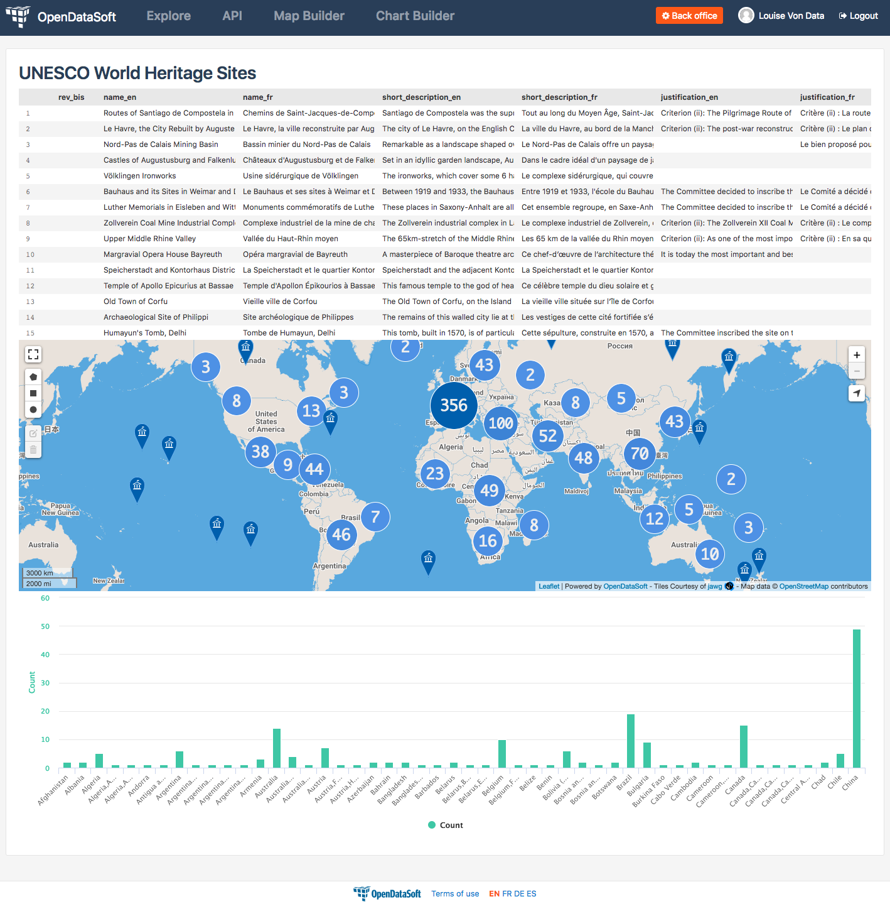

How to build a dashboard (part 1)
=================================

.. rst-class:: header-information-tutorial

    ★☆☆ Beginner - time: 30 minutes

*This tutorial will teach you how to create a dashboard using 3 visualizations from a dataset published on an OpenDataSoft portal.*

During this tutorial, you will learn:

- what a widget is
- what an iframe is
- what is the difference between a widget and an iframe
- how to use a widget in a content page created with OpenDataSoft

Prerequisites:

- In order to create a dashboard, you need to have access to the back office of an OpenDataSoft portal and the "Edit all pages" permission.
- We highly recomment to follow the tutorial with the  `World Heritage List dataset published on our data network, Data <https://data.opendatasoft.com/explore/dataset/world-heritage-list%40public-us/map/?location=2,18.46273,-0.44037&basemap=mapbox.streets>`_. This dataset will be our example dataset used throughout the whole tutorial. If you however choose to follow the tutorial with another dataset, make sure to choose one with a Table view, as well as a Map view and an Analyze view. You will also need to adapt your own page code for it to match your chosen dataset.

.. PART 1 - CREATE CONTENT PAGE:

.. rst-class:: title-level-2

    Create your content page

.. rst-class:: block-step

    1 _ Go the Back office, in the Pages section.

.. rst-class:: img-hide

    .. image:: images/steps_d1/step1.png

.. rst-class:: block-step

    2 _ Click on the + New page button, to create a new content page.

.. rst-class:: img-hide

    .. image:: images/steps_d1/step2.png

.. rst-class:: block-step

    3 _ By default, you land on the Properties tab. It contains several information about the page, some of which you need to fill up otherwise you will not be able to save the page. Enter a page URL suffix and a title. You can also add a description and tags.

.. rst-class:: img-hide

    .. image:: images/steps_d1/step3.png

.. rst-class:: block-step

    4 _ Click the Save button to save your newly created content page.

.. rst-class:: img-hide

    .. image:: images/steps_d1/step4.png

.. rst-class:: block-step

    5 _ Go to the Content tab.

.. rst-class:: img-hide

    .. image:: images/steps_d1/step5.png

.. rst-class:: block-step

    6 _ Click on Edit in expert mode to access the HTML/CSS code of the page. A pop up will appear, click on "Yes, switch to expert mode" for confirmation matter.

.. rst-class:: img-hide

    .. image:: images/steps_d1/step6.png

In the HTML/CSS code area, you should see the following code:

.. code-block:: html

	

	    

	

.. admonition:: Important
   :class: important

   In the HTML language, every element is represented by a tag. This tag is written between ``<`` and ``>`` and always comes in a pair, with an opening tag and a closing tag. E.g. ``

`` for paragraphs, ``<h1></h1>`` for first level title, ``

`` for a division/section, etc.

The ``
`` and ``
`` tags help formatting your page the right way, in order for all elements of your content page to be in a predefined frame with borders. All new elements that you will add in the future should be put inside these 2 tags.

.. code-block:: html

 

  

    This is where you will put your code

  

 

.. rst-class:: img-hide

    .. image:: images/steps_d1/step6b.png

.. rst-class:: block-step

    7 _ Save your page.

.. rst-class:: img-hide

    .. image:: images/steps_d1/step7.png

.. rst-class:: block-step

    8 _ Click on the Open page button to see the current result of your page.

.. rst-class:: img-hide

    .. image:: images/steps_d1/step8.png

.. PART 2 - ADD DATA VISUALIZATIONS:

.. rst-class:: title-level-2

    Put content in your page: data visualizations

.. rst-class:: title-level-3

    Get the widget code of a visualization

.. admonition:: Important
   :class: important

   A widget is a piece of code that allows anyone to integrate an interactive element directly on a webpage. In OpenDataSoft, there are several widgets which are `all listed and explained in the widget documentation <https://help.opendatasoft.com/widgets/#/api/>`_. Some of the most common OpenDataSoft widgets -those we will use in this tutorial- are the visualization widgets. Each data visualization of a published dataset is indeed available as a widget, which code is displayed below the visualization, ready to be copied!

.. rst-class:: block-step

    9 _ Go to Data, where our dataset is published. Make sure you are on the dataset's page, where you can see the available data visualizations.

.. rst-class:: img-hide

    .. image:: images/steps_d1/step10.png

.. rst-class:: block-step

    10 _ Let's start with the Table view. Click on the Table tab.

.. rst-class:: img-hide

    .. image:: images/steps_d1/step9.png

.. rst-class:: block-step

    11 _ Scroll down the table. You should see 3 tabs: Share, Embed and Widget. Share displays the direct URL of the visualization. Embed displays the iframe code of the visualization. Widget displays the widget code of the visualizations. Each, whereas it is a URL or a code, are ready to be copied and pasted. For this tutorial, we will use the widget codes of the Table, Map and Analyze visualizations of our dataset.

.. admonition:: Important
   :class: important

   An iframe allows anyone to show OpenDataSoft content in an isolated frame, independent from the rest of the page. Iframes, as opposed to widgets, are indeed all-in-one, integrated, and secure, so they can be embedded outside the OpenDataSoft environment, at the cost of interaction and customization. Widgets are more customizable and interactive (i.e: several widgets on the same page can interact with each other), but can only work inside OpenDataSoft pages.

.. rst-class:: block-step

    12 _ Still in the Table tab of our dataset, where the widget code is displayed, click the COPY button to copy the widget code of the table visualization.

.. rst-class:: title-level-3

    Add a visualization widget to your page

.. rst-class:: block-step

    13 _ Go back to the back office, to continue to edit your OpenDataSoft content page.

.. rst-class:: img-hide

    .. image:: images/steps_d1/step13.png

.. rst-class:: block-step

    14 _ Paste your table visualization widget code at the right place, between the ``ods-box`` tag (see step 6).

.. code-block:: html

 

   

     <ods-dataset-context context="worldheritagelistpublicus" worldheritagelistpublicus-dataset="world-heritage-list@public-us" worldheritagelistpublicus-parameters="{'disjunctive.states':true,'sort':'date_inscribed'}">
       <ods-table context="worldheritagelistpublicus" sort="date_inscribed"></ods-table>
     </ods-dataset-context>

   

 

.. rst-class:: img-hide

    .. image:: images/steps_d1/step14.png

.. rst-class:: block-step

    15 _ Save your page and click the Open page button: there is now a table visualization in our page!

.. rst-class:: img-hide

    .. image:: images/steps_d1/step15.png

.. rst-class:: title-level-3

    Add more widgets to your page: map and chart

.. rst-class:: block-step

    16 _ Let's add a map to our page! Just like before, get the widget code of the Map view of our dataset (see steps 9 to 12, but applied to the Map tab).

.. rst-class:: block-step

    17 _ Paste your map visualization widget code below the widget code of the table visualization (see Add a widget to your page).

.. code-block:: html

 

   

     <ods-dataset-context context="worldheritagelistpublicus" worldheritagelistpublicus-dataset="world-heritage-list@public-us" worldheritagelistpublicus-parameters="{'disjunctive.states':true,'sort':'date_inscribed'}">
       <ods-table context="worldheritagelistpublicus" sort="date_inscribed"></ods-table>
     </ods-dataset-context>

     <ods-dataset-context context="worldheritagelistpublicus" worldheritagelistpublicus-dataset="world-heritage-list@public-us" worldheritagelistpublicus-parameters="{'disjunctive.states':true,'sort':'date_inscribed'}">
       <ods-map context="worldheritagelistpublicus" scroll-wheel-zoom="false" location="2,18.46273,-0.44037" basemap="mapbox.streets"></ods-map>
     </ods-dataset-context>

   

 

.. rst-class:: img-hide

    .. image:: images/steps_d1/step17.png

.. rst-class:: block-step

    18 _ Let's add one more thing: a chart! Get the widget code of the Analyze view of our dataset.

.. rst-class:: block-step

    19 _ Paste your analyze visualization widget code below the widget code of the map visualization.

.. code-block:: html

 

   

     <ods-dataset-context context="worldheritagelistpublicus" worldheritagelistpublicus-dataset="world-heritage-list@public-us">
       <ods-table context="worldheritagelistpublicus"></ods-table>
     </ods-dataset-context>

     <ods-dataset-context context="worldheritagelistpublicus" worldheritagelistpublicus-dataset="world-heritage-list@public-us">
       <ods-map context="worldheritagelistpublicus" scroll-wheel-zoom="false" location="2,18.46273,-0.44037" basemap="mapbox.streets"></ods-map>
     </ods-dataset-context>

     <ods-dataset-context context="worldheritagelistpublicus" worldheritagelistpublicus-dataset="world-heritage-list@public-us" worldheritagelistpublicus-parameters="{'disjunctive.states':true,'sort':'date_inscribed'}">
       <ods-chart align-month="true">
         <ods-chart-query context="worldheritagelistpublicus" field-x="region" maxpoints="50" stacked="normal" series-breakdown="category">
           <ods-chart-serie expression-y="area_hectares" chart-type="column" function-y="COUNT" color="range-Accent" scientific-display="true">
           </ods-chart-serie>
         </ods-chart-query>
       </ods-chart>
     </ods-dataset-context>

   

 

.. rst-class:: img-hide

    .. image:: images/steps_d1/step19.png

.. rst-class:: block-step

    20 _ Save your page and click the Open page button. We have now 3 visualizations on our page!

.. rst-class:: img-hide

    .. image:: images/steps_d1/step20.png

.. PART 3 - ADD A TITLE:

.. rst-class:: title-level-2

    Complete your content page with a title

.. rst-class:: block-step

    21 _ In HTML, titles (called headers) are generally defined by ``h1`` tags. The h doesnt change, it stands for "header". The number (here 1) can however be replaced by any number from 1 to 6, ``h1`` being the highest level title and ``h6`` the lowest. Above all visualization widget codes added to the page, and right below the ``ods-box`` tag, add a high level title to your content page.

.. code-block:: html

 

   

     <h1>Write your title here</h1>

     <ods-dataset-context context="worldheritagelistpublicus" worldheritagelistpublicus-dataset="world-heritage-list@public-us">
       <ods-table context="worldheritagelistpublicus"></ods-table>
     </ods-dataset-context>

     <ods-dataset-context context="worldheritagelistpublicus" worldheritagelistpublicus-dataset="world-heritage-list@public-us">
       <ods-map context="worldheritagelistpublicus" scroll-wheel-zoom="false" location="2,18.46273,-0.44037" basemap="mapbox.streets"></ods-map>
     </ods-dataset-context>

     <ods-dataset-context context="worldheritagelistpublicus" worldheritagelistpublicus-dataset="world-heritage-list@public-us" worldheritagelistpublicus-parameters="{'disjunctive.states':true,'sort':'date_inscribed'}">
       <ods-chart align-month="true">
         <ods-chart-query context="worldheritagelistpublicus" field-x="region" maxpoints="50" stacked="normal" series-breakdown="category">
           <ods-chart-serie expression-y="area_hectares" chart-type="column" function-y="COUNT" color="range-Accent" scientific-display="true">
           </ods-chart-serie>
         </ods-chart-query>
       </ods-chart>
     </ods-dataset-context>

   

 

.. rst-class:: img-hide

    .. image:: images/steps_d1/step21.png

.. rst-class:: block-step

    22 _ Save your page and click the Open page button: our dashboard now has a title!

.. rst-class:: img-hide

    .. image:: images/steps_d1/step22.png

Congratulations! You have finished this tutorial and you now know how to create a simple dashboard with 3 dataset visualizations!

If you want to go further with your dashboard, you can follow the second part of this tutorial: :doc:`"How to build a dashboard (part 2)" <how_to_build_dashboard_part2>`. It will teach you how to link your widgets together, how to add more advanced widgets but also how to organize and style your dashboard better.
