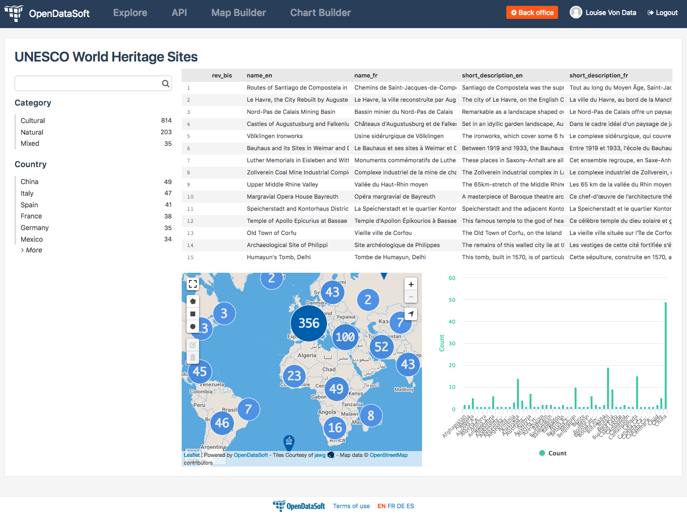
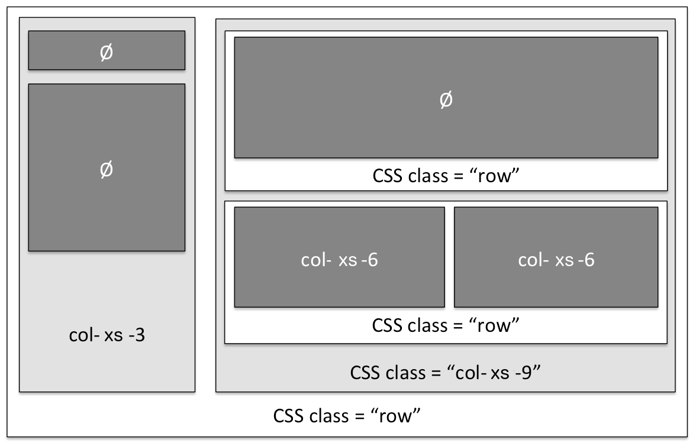

How to build a dashboard (part 2)
=================================

.. role:: tutorial-keycap(emphasis)

.. rst-class:: header-information-tutorial

    ★★☆ Intermediate - time: 1 hour

*This tutorial will teach you how to go from a simple dashboard with 3 visualizations to an organized, formatted dashboard with interactive widgets linked with one another!*

During this tutorial, you will learn:

- how to link widgets together using a context
- how to add other Opendatasoft widgets
- how to use CSS classes to format and organize your dashboard

.. rst-class:: block-prerequisite-congratulation

 **PREREQUISITES**

 - In order to create a dashboard, you need to have access to the back office of an Opendatasoft portal and the "Edit all pages" permission.
 - You are highly recommended to follow the first part of this dashboard tutorial, :doc:`"How to build a dashboard (part 1)" <how_to_build_dashboard_part1>`, since this second part starts with what we ended with in the first part. The prerequisites of the first part also contain all information about the chosen example dataset.

.. HIDE ALL / SHOW ALL:

.. rst-class:: expand-collapse-items expand-all expand-collapse-item-active

    Show all images

.. rst-class:: expand-collapse-items collapse-all

    Hide all images

.. PART 1 - LINK WIDGETS:

.. rst-class:: title-level-2

    Link your widgets together

At the end of the first part of this tutorial to build a dashboard, we had a simple dashboard with a title and 3 widgets (a table view, a map view and a chart from one same dataset) one on top of the other. Now, in the previous part, we saw that the great advantage of widgets is that they can interact with each other. However, if we draw a shape on the map, it filters the displayed items of the map, but unfortunatly only the map reacts. Both the table and chart ignore our filter.

It is because our widgets are not yet linked to one another. The secret to do this, is to use the same context for all widgets. The context is the pivot between each element of your page, this is why all the widgets that should interact together must use the same context. More than that, the context is the link between your widgets and the dataset behind: it defines on which dataset your widgets should work, the data from which dataset your widgets should use.

.. rst-class:: block-step

    1 + Let's find this context! Look at the HTML code of your page. For each widget we added, its code contains 2 main elements: an ``ods-dataset-context`` first, then an ``ods-map`` or ``ods-table`` or ``ods-chart`` depending on the widget. In the code below, we added comments just in order to help you see the different elements that we have.

.. code-block:: html

 

   

     <!-- TITLE OF THE PAGE -->
     <h1>UNESCO World Heritage</h1>

     <!-- TABLE WIDGET -->
     <!-- Context of the table -->
     <ods-dataset-context context="worldheritagelistpublicus" worldheritagelistpublicus-dataset="world-heritage-list@public-us">
       <!-- Table widget tag -->
       <ods-table context="worldheritagelistpublicus"></ods-table>
     </ods-dataset-context>

     <!-- MAP WIDGET -->
     <!-- Context of the map -->
     <ods-dataset-context context="worldheritagelistpublicus" worldheritagelistpublicus-dataset="world-heritage-list@public-us">
       <!-- Map widget tag -->
       <ods-map context="worldheritagelistpublicus" scroll-wheel-zoom="false" location="2,18.46273,-0.44037" basemap="mapbox.streets"></ods-map>
     </ods-dataset-context>

     <!-- CHART WIDGET -->
     <!-- Context of the chart -->
     <ods-dataset-context context="worldheritagelistpublicus" worldheritagelistpublicus-dataset="world-heritage-list@public-us" worldheritagelistpublicus-parameters="{'disjunctive.states':true,'sort':'date_inscribed'}">
       <!-- Chart widget tags -->
       <ods-chart align-month="true">
         <ods-chart-query context="worldheritagelistpublicus" field-x="region" maxpoints="50" stacked="normal" series-breakdown="category">
           <ods-chart-serie expression-y="area_hectares" chart-type="column" function-y="COUNT" color="range-Accent" scientific-display="true">
           </ods-chart-serie>
         </ods-chart-query>
       </ods-chart>
     </ods-dataset-context>

   

 

.. rst-class:: img-hide

    .. image:: images/steps_d2/step1.png

As you can see, we have a context for each widget. First, it is not so useful in our case, since all our widgets use the same data from the same dataset. Second, it prevents us to link our widgets together. We must have a unique context.

.. rst-class:: block-step

    2 + At the very beginning of your code, above the div tag with the container-fluid class, declare the unique context of your page. Just like for the widgets, use the tag ``ods-dataset-context`` (and don't forget the closing tag!). Look at the code below to understand how this tag works (once again, comments are used to add explainations to the code).

.. code-block:: html

 <ods-dataset-context context="worldheritagelistpublicus"
                      worldheritagelistpublicus-dataset="world-heritage-list@public-us">

     <!--
         worldheritagelistpublicus: name of your context
         world-heritage-list@public-us: technical identifier of your dataset
     -->

 </ods-dataset-context>

.. rst-class:: img-hide

    .. image:: images/steps_d2/step2.png

.. rst-class:: block-step

    3 + Delete the context of each widget. Don't forget that tags come in pairs: you must delete both the opening tag and closing tag for each widget. Your code should now look like this, with a unique context followed by the 3 widgets tags:

.. code-block:: html

 <ods-dataset-context context="worldheritagelistpublicus"
 worldheritagelistpublicus-dataset="world-heritage-list@public-us">

 

   

     <h1>UNESCO World Heritage</h1>

     <ods-table context="worldheritagelistpublicus"></ods-table>

     <ods-map context="worldheritagelistpublicus" scroll-wheel-zoom="false" location="2,18.46273,-0.44037" basemap="mapbox.streets"></ods-map>

     <ods-chart align-month="true">
       <ods-chart-query context="worldheritagelistpublicus" field-x="region" maxpoints="50" stacked="normal" series-breakdown="category">
         <ods-chart-serie expression-y="area_hectares" chart-type="column" function-y="COUNT" color="range-Accent" scientific-display="true">
         </ods-chart-serie>
       </ods-chart-query>
     </ods-chart>

   

 

 </ods-dataset-context>

.. rst-class:: img-hide

    .. image:: images/steps_d2/step3.png

.. rst-class:: block-step

    4 + Save your page and click the :tutorial-keycap:`Open page` button. Now, if you draw a shape on the map, the map will be filtered according to that shape, but both the table and chart will be filtered as well according to that same filter. Our widgets are linked together!

.. rst-class:: img-hide

    .. image:: images/steps_d2/step4.png

.. PART 2 - ADD MORE WIDGETS:

.. rst-class:: title-level-2

    Add more Opendatasoft widgets

.. rst-class:: block-step

    5 + Now that our widgets are linked, why not add more widgets to make our dashboard even better? Let's start by adding a search bar. It would allow us to make a textual research on all the visualizations at the same time. Go to the Opendatasoft widgets documentation to learn more about the widget we are goint to use, which is called `odsTextSearch <https://help.opendatasoft.com/widgets/#/api/ods-widgets.directive:odsTextSearch>`_.

In the odsTextSearch widget documentation, you have several information:

   - the description, to know what the widget can be used for
   - the widget code, to copy and paste in the code of your page
   - a table with the attributes of the widget, which values you must fill up for the widget to work
   - example of both the final code and the final result

.. rst-class:: img-hide

    .. image:: images/steps_d2/step5.png

.. rst-class:: block-step

    6 + Copy the odsTextSearch widget code.

.. code-block:: html

 <ods-text-search
       placeholder="{string}"
       button="{string}"
       field="{string}"
       suffix="{string}"
       context="{CatalogContext|DatasetContext|CatalogContext[]|DatasetContext[]}"
       autofocus="{string}">
 </ods-text-search>

.. rst-class:: img-hide

    .. image:: images/steps_d2/step6.png

.. rst-class:: block-step

    7 + Paste the widget code in the code of your page, where you want it to be displayed. Let's put it under the title, above the first visualization widget.

.. admonition:: Caution
   :class: caution

   Do not save your page yet! Since the attributes of the widget are not completed yet, the platform will consider your widget as invalid and it will create an error.

.. code-block:: html

 <ods-dataset-context context="worldheritagelistpublicus"
 worldheritagelistpublicus-dataset="world-heritage-list@public-us">

 

   

     <h1>UNESCO World Heritage</h1>

     <ods-text-search
     placeholder="{string}"
     button="{string}"
     field="{string}"
     suffix="{string}"
     context="{CatalogContext|DatasetContext|CatalogContext[]|DatasetContext[]}"
     autofocus="{string}">
   </ods-text-search>

   <ods-table context="worldheritagelistpublicus"></ods-table>

   <ods-map context="worldheritagelistpublicus" scroll-wheel-zoom="false" location="2,18.46273,-0.44037" basemap="mapbox.streets"></ods-map>

   <ods-chart align-month="true">
     <ods-chart-query context="worldheritagelistpublicus" field-x="region" maxpoints="50" stacked="normal" series-breakdown="category">
       <ods-chart-serie expression-y="area_hectares" chart-type="column" function-y="COUNT" color="range-Accent" scientific-display="true">
       </ods-chart-serie>
     </ods-chart-query>
   </ods-chart>

 

 

 </ods-dataset-context>

.. rst-class:: img-hide

    .. image:: images/steps_d2/step7.png

.. rst-class:: block-step

    8 + As it is now, the search bar cannot work. First, we need to determine which attributes we need, and fill their values up. For this widget, only the ``context`` attribute is mandatory. To keep things simple for this tutorial, let's delete all other attributes.

.. code-block:: html

 <ods-text-search context="{CatalogContext|DatasetContext|CatalogContext[]|DatasetContext[]}">
 </ods-text-search>

.. rst-class:: img-hide

    .. image:: images/steps_d2/step8.png

.. rst-class:: block-step

    9 + At the beginning of this tutorial (see step 2), we created a unique context that can be used throughout our whole page. The name of our context is "worldheritagelistpublicus". It is that same context name that we must use to fill up the context attribute of our odsTextSearch widget.

.. code-block:: html

 <ods-text-search context="worldheritagelistpublicus">
 </ods-text-search>

.. code-block:: html

 <ods-dataset-context context="worldheritagelistpublicus"
 worldheritagelistpublicus-dataset="world-heritage-list@public-us">

 

   

     <h1>UNESCO World Heritage</h1>

     <ods-text-search context="worldheritagelistpublicus">
     </ods-text-search>

     <ods-table context="worldheritagelistpublicus"></ods-table>

     <ods-map context="worldheritagelistpublicus" scroll-wheel-zoom="false" location="2,18.46273,-0.44037" basemap="mapbox.streets"></ods-map>

     <ods-chart align-month="true">
       <ods-chart-query context="worldheritagelistpublicus" field-x="region" maxpoints="50" stacked="normal" series-breakdown="category">
         <ods-chart-serie expression-y="area_hectares" chart-type="column" function-y="COUNT" color="range-Accent" scientific-display="true">
         </ods-chart-serie>
       </ods-chart-query>
     </ods-chart>

   

 

 </ods-dataset-context>

.. rst-class:: img-hide

    .. image:: images/steps_d2/step9.png

.. rst-class:: block-step

    10 + Save your page and click on :tutorial-keycap:`Preview`. We now have a search bar in our dashboard!

.. rst-class:: img-hide

    .. image:: images/steps_d2/step10.png

.. rst-class:: block-step

    11 + Let's add another very useful element to our dashboard: filters! It would allow us to apply filters on our visualizations, just like when navigating a dataset. Go to the Opendatasoft widgets documentation to learn more about the widget we are goint to use, which is called `odsFacets <https://help.opendatasoft.com/widgets/#/api/ods-widgets.directive:odsFacets>`_.

.. admonition:: Important
   :class: important

   The odsFacets widget allows to retrieve the filters already set for the dataset. It means that if you use this widget for a dashboard, but which related dataset does not have any defined filter, your widget won't be able to display anything.

.. rst-class:: img-hide

    .. image:: images/steps_d2/step11.png

.. rst-class:: block-step

    12 + Copy the odsFacets widget code.

.. code-block:: html

 <ods-facets context="{DatasetContext}">
 </ods-facets>

.. rst-class:: img-hide

    .. image:: images/steps_d2/step12.png

.. rst-class:: block-step

    13 + Paste the widget code in the code of your page, where you want it to be displayed. Let's put it under our search bar.

.. code-block:: html

 <ods-dataset-context context="worldheritagelistpublicus"
 worldheritagelistpublicus-dataset="world-heritage-list@public-us">

 

   

     <h1>UNESCO World Heritage</h1>

     <ods-text-search context="worldheritagelistpublicus">
     </ods-text-search>

     <ods-facets context="{DatasetContext}">
     </ods-facets>

     <ods-table context="worldheritagelistpublicus"></ods-table>

     <ods-map context="worldheritagelistpublicus" scroll-wheel-zoom="false" location="2,18.46273,-0.44037" basemap="mapbox.streets"></ods-map>

     <ods-chart align-month="true">
       <ods-chart-query context="worldheritagelistpublicus" field-x="region" maxpoints="50" stacked="normal" series-breakdown="category">
         <ods-chart-serie expression-y="area_hectares" chart-type="column" function-y="COUNT" color="range-Accent" scientific-display="true">
         </ods-chart-serie>
       </ods-chart-query>
     </ods-chart>

   

 

 </ods-dataset-context>

.. rst-class:: img-hide

    .. image:: images/steps_d2/step13.png

.. rst-class:: block-step

    14 + Just like we did with the odsTextSearch widget, we need to fill up the attributes of the odsFacets widget. The latter only has one: the ``context`` attribute! Let's fill it up with the name of our page context, exactly as we did for the odsTextSearch widget!

.. code-block:: html

 <ods-facets context="worldheritagelistpublicus">
 </ods-facets>

.. code-block:: html

 <ods-dataset-context context="worldheritagelistpublicus"
 worldheritagelistpublicus-dataset="world-heritage-list@public-us">

 

   

     <h1>UNESCO World Heritage</h1>

     <ods-text-search context="worldheritagelistpublicus">
     </ods-text-search>

     <ods-facets context="worldheritagelistpublicus">
     </ods-facets>

     <ods-table context="worldheritagelistpublicus"></ods-table>

     <ods-map context="worldheritagelistpublicus" scroll-wheel-zoom="false" location="2,18.46273,-0.44037" basemap="mapbox.streets"></ods-map>

     <ods-chart align-month="true">
       <ods-chart-query context="worldheritagelistpublicus" field-x="region" maxpoints="50" stacked="normal" series-breakdown="category">
         <ods-chart-serie expression-y="area_hectares" chart-type="column" function-y="COUNT" color="range-Accent" scientific-display="true">
         </ods-chart-serie>
       </ods-chart-query>
     </ods-chart>

   

 

 </ods-dataset-context>

.. rst-class:: img-hide

    .. image:: images/steps_d2/step14.png

.. rst-class:: block-step

    15 + Save your page and click on :tutorial-keycap:`Preview`. The filters of our dataset are now displayed in our dashboard!

.. rst-class:: img-hide

    .. image:: images/steps_d2/step15.png

.. rst-class:: block-step

    16 + Now, say we don't want to display all the filters of our dataset. In our UNESCO World Heritage example, let's say we only want to be able to filter by category and country. Copy the following piece of code (also available in the odsFacets widget documentation):

.. code-block:: html

 <ods-facets context="mycontext">
    <h3>First field</h3>
    <ods-facet name="myfield"></ods-facet>

    <h3>Second field</h3>
    <ods-facet name="mysecondfield"></ods-facet>
 </ods-facets>

.. rst-class:: img-hide

    .. image:: images/steps_d2/step16.png

.. rst-class:: block-step

    17 + Paste it in replacement of the previous, simple odsFacets widget code we used earlier.

.. code-block:: html

 <ods-dataset-context context="worldheritagelistpublicus"
 worldheritagelistpublicus-dataset="world-heritage-list@public-us">

 

   

     <h1>UNESCO World Heritage</h1>

     <ods-text-search context="worldheritagelistpublicus">
     </ods-text-search>

     <ods-facets context="mycontext">
       <h3>First field</h3>
       <ods-facet name="myfield"></ods-facet>

       <h3>Second field</h3>
       <ods-facet name="mysecondfield"></ods-facet>
     </ods-facets>

     <ods-table context="worldheritagelistpublicus"></ods-table>

     <ods-map context="worldheritagelistpublicus" scroll-wheel-zoom="false" location="2,18.46273,-0.44037" basemap="mapbox.streets"></ods-map>

     <ods-chart align-month="true">
       <ods-chart-query context="worldheritagelistpublicus" field-x="region" maxpoints="50" stacked="normal" series-breakdown="category">
         <ods-chart-serie expression-y="area_hectares" chart-type="column" function-y="COUNT" color="range-Accent" scientific-display="true">
         </ods-chart-serie>
       </ods-chart-query>
     </ods-chart>

   

 

 </ods-dataset-context>

.. rst-class:: img-hide

    .. image:: images/steps_d2/step17.png

.. rst-class:: block-step

    18 + Fill up the context attribute correctly, with the name of your page context.

.. code-block:: html

 <ods-facets context="worldheritagelistpublicus">
   <h3>First field</h3>
   <ods-facet name="myfield"></ods-facet>

   <h3>Second field</h3>
   <ods-facet name="mysecondfield"></ods-facet>
 </ods-facets>

.. rst-class:: img-hide

    .. image:: images/steps_d2/step18.png

.. rst-class:: block-step

    19 + Let's now take a look at the rest of the odsFacets widget advanced code. The 2 ``h3`` tags indicate that we have added titles: these will be used to write the name of the filters we want to display, meaning "Category" and "Country". ``ods-facet name`` is the attribute which will indicate the technical identifier of the field on which the filter is based.

.. admonition:: Note
   :class: note

   To get the technical identifier of a field, you need to be aware of the dataset schema. It is available in the Information tab of the dataset. The dataset schema shows all information about each field: name (label), description, identifier, type, and a value exemple. It's often convenient to know the type and the identifier of each field when using advanced widget parameters.

In the code below, comment were added just in order to help you see the different elements that we have.

.. code-block:: html

 <!-- CONTEXT NAME -->
 <ods-facets context="worldheritagelistpublicus">
    <!-- Name of filter #1 -->
    <h3>First field</h3>
    <!-- Technical identifier of related field -->
    <ods-facet name="myfield"></ods-facet>

    <!-- Name of filter #2 -->
    <h3>Second field</h3>
    <!-- Technical identifier of related field -->
    <ods-facet name="mysecondfield"></ods-facet>
  </ods-facets>

.. rst-class:: img-hide

    .. image:: images/steps_d2/step19.png

.. rst-class:: block-step

    20 + Go to the Dataset schema section of the Information tab of your dataset.

.. rst-class:: img-hide

    .. image:: images/steps_d2/step20.png

.. rst-class:: block-step

    21 + Find the technical identifiers of the fields on which are based the filters you want to add to the dashboard. In our UNESCO World Heritage example dataset, we wanted to filter by category and country. Respectively, the technical identifiers of the fields we want to use as filters are ``category`` and ``states``.

.. rst-class:: img-hide

    .. image:: images/steps_d2/step21.png

.. rst-class:: block-step

    22 + Back to the code of your dashboard, fill up both the titles and the ``ods-facet name`` attributes.

.. code-block:: html

 <ods-facets context="worldheritagelistpublicus">
   <h3>Category</h3>
   <ods-facet name="category"></ods-facet>

   <h3>Country</h3>
   <ods-facet name="states"></ods-facet>
 </ods-facets>

.. code-block:: html

 <ods-dataset-context context="worldheritagelistpublicus"
 worldheritagelistpublicus-dataset="world-heritage-list@public-us">

 

   

     <h1>UNESCO World Heritage</h1>

     <ods-text-search context="worldheritagelistpublicus">
     </ods-text-search>

     <ods-facets context="worldheritagelistpublicus">
       <h3>Category</h3>
       <ods-facet name="category"></ods-facet>

       <h3>Country</h3>
       <ods-facet name="states"></ods-facet>
     </ods-facets>

     <ods-table context="worldheritagelistpublicus"></ods-table>

     <ods-map context="worldheritagelistpublicus" scroll-wheel-zoom="false" location="2,18.46273,-0.44037" basemap="mapbox.streets"></ods-map>

     <ods-chart align-month="true">
       <ods-chart-query context="worldheritagelistpublicus" field-x="region" maxpoints="50" stacked="normal" series-breakdown="category">
         <ods-chart-serie expression-y="area_hectares" chart-type="column" function-y="COUNT" color="range-Accent" scientific-display="true">
         </ods-chart-serie>
       </ods-chart-query>
     </ods-chart>

   

 

 </ods-dataset-context>

.. rst-class:: img-hide

    .. image:: images/steps_d2/step22.png

.. rst-class:: block-step

    23 + Save your page and click on :tutorial-keycap:`Preview`. Our 2 chosen filters are displayed on our dashboard!

.. rst-class:: img-hide

    .. image:: images/steps_d2/step23.png

.. PART 2 - ORGANIZE IN ROWS AND COLUMNS:

.. rst-class:: title-level-2

    Format your dashboard: organize your widgets in rows and columns

Our dashboard is quite nice, but to make it even nicer we should now give it some style and organize it differently. For now, we have simply piled up all our elements (both titles and widgets). Let's change that!

We will organize our dashboard in 2 parts:

- on the left, we will put our navigation elements (the search bar, and the filters underneath)
- on the right, we will put our data visualizations (the table, and underneath the map and the chart one next to the other)

 .. image:: images/dashboard__css-responsive-layout-1.png

Now, how can we achieve that look for our dashboard? Picture your page as a container. Inside this container, you can have as many rows as you want. Each one of these rows is split into 12 columns of the same size.

In HTML code, this is what it looks like:

.. code-block:: html

 

    

        
col-1

        
col-1

        
col-1

        
col-1

        
col-1

        
col-1

        
col-1

        
col-1

        
col-1

        
col-1

        
col-1

        
col-1

    

 

When your create a page and want to organize the elements that compose your page, you must put them in rows. For each element, you must decide how many columns you want to allocate to that element.

.. rst-class:: block-step

    24 + Let's reorganize our dashboard in rows and columns. For our example, we will put both the navigation part and the data visualization part in the same row. We will use 3 columns for the navigation elements, and the remaining 9 columns for our visualization elements. Since we wanted to put the map and chart visualizations one next to the other, we will create a row for these 2 : each using 6 columns.

In HTML code, this is what our dashboard will look like:

.. code-block:: html

 <ods-dataset-context context="worldheritagelistpublicus"
 worldheritagelistpublicus-dataset="world-heritage-list@public-us">

 

   

     <h1>

       

         <!-- NAVIGATION PART -->
         

           <!-- Search bar here -->
           <!-- Filters here -->

         

         <!-- VISUALIZATIONS PART -->
         

           <!-- Table widget here -->

           

             
 <!-- Map widget on the left --> 

             
 <!-- Chart widget on the right --> 

           

         

       

   

 

 </ods-dataset-context>

.. rst-class:: img-hide

    .. image:: images/steps_d2/step24.png

.. rst-class:: block-step

    25 + Save your page and click on :tutorial-keycap:`Preview`. What a cool dashboard we have created!

.. rst-class:: img-hide

    .. image:: images/steps_d2/step25.png

.. rst-class:: block-step

    26 + Maybe a little bit more space between the table and the 2 other visualizations would be better though. Let's add a ``br`` tag under the table widget, right before the row containing both the map widget and the chart widget. This tag signifies that we want to add an extra empty ligne at the place of the tag. It is also one of the HTML tags that does not come in a pair!

.. code-block:: html

 <ods-dataset-context context="worldheritagelistpublicus"
 worldheritagelistpublicus-dataset="world-heritage-list@public-us">

 

   

     <h1>UNESCO World Heritage</h1>

     

       

         <ods-text-search context="worldheritagelistpublicus">
         </ods-text-search>

         <ods-facets context="worldheritagelistpublicus">
           <h3>Category</h3>
           <ods-facet name="category"></ods-facet>

           <h3>Country</h3>
           <ods-facet name="states"></ods-facet>
         </ods-facets>

       

       

         <ods-table context="worldheritagelistpublicus"></ods-table>

          

         

           

             <ods-map context="worldheritagelistpublicus" scroll-wheel-zoom="false" location="2,18.46273,-0.44037" basemap="mapbox.streets"></ods-map>
           

           

             <ods-chart align-month="true">
               <ods-chart-query context="worldheritagelistpublicus" field-x="region" maxpoints="50" stacked="normal" series-breakdown="category">
                 <ods-chart-serie expression-y="area_hectares" chart-type="column" function-y="COUNT" color="range-Accent" scientific-display="true">
                 </ods-chart-serie>
               </ods-chart-query>
             </ods-chart>
           

         

       

     

   

 

 </ods-dataset-context>

.. rst-class:: img-hide

    .. image:: images/steps_d2/step26.png

.. rst-class:: block-step

    27 + Save again and click the Open page button to see the final result!

|

.. rst-class:: block-prerequisite-congratulation

 **CONGRATULATIONS!**

 You have finished this tutorial and you now know how to create a complete dashboard with linked widgets and how to format it with CSS classes! If you want to go further with these CSS classes and learn more about responsiveness, don't hesitate to `check our documentation about these topics <https://help.opendatasoft.com/platform/en/customizing_look_and_feel/07_designing_responsive_portal/responsive.html#responsive-page-layouts>`_!
