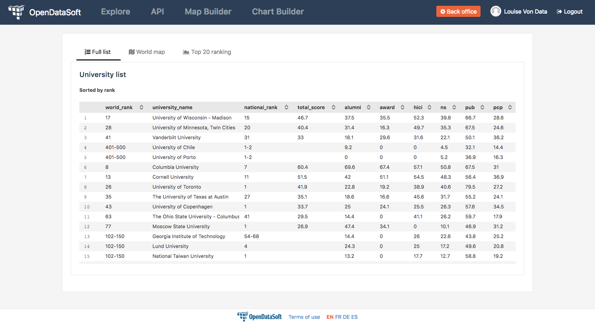

How to create tabs (with AngularJS)
===================================

.. role:: tutorial-keycap(emphasis)

.. rst-class:: header-information-tutorial

    ★★★ Advanced - time: 45 minutes

*This tutorial will teach you how to create tabs using AngularJS. These tabs will be fully customizable and reusable in any dashboard or piece of content created with HTML/CSS on OpenDataSoft.*

During this tutorial, you will learn how to use 4 AngularJS directives:

- ``ng-if``
- ``ng-click``
- ``ng-class``
- ``ng-init``

.. rst-class:: block-prerequisite-congratulation

 **PREREQUISITES**

 - In order to test this tutorial and/or integrate the tabs in an already existing page, you need to have access to the back office of an OpenDataSoft portal and be granted the "Edit all pages" permission.
 - Since this tutorial is labeled as "Advanced" in terms of difficulty level, we assume that you already know HTML and CSS well enough to recognize and understand their structures and how they work. Other more technical elements will however be explained in details.

.. HIDE ALL / SHOW ALL:

.. rst-class:: expand-collapse-items expand-all expand-collapse-item-active

    Show all images

.. rst-class:: expand-collapse-items collapse-all

    Hide all images

.. PART 1 - HTML BASE:

.. rst-class:: title-level-2

    Create the structure

.. rst-class:: block-step

    1 + In this tutorial, we will create 3 tabs, considering that each tab is comprised of a clickable tab title and the content of the tab. In our code, we will manage the tab titles on the one hand and the tab contents on the other hand. Let's start with the structure of our tab titles! Put each tab title in an ``<a>`` tag, and all ``<a>`` tags into a ``
`` tag.

.. admonition:: Note
   :class: note

   For this tutorial, we chose to put the tab titles in an ``<a>`` tag for accessibility reasons. That tag is also handy because it allows all titles to be displayed on the same line. If you feel comfortable enough with HTML/CSS, you can put your tab titles in another tag, but keep in mind that you will probably have to use more CSS to make them look like in this tutorial.

.. admonition:: Note
   :class: note

   Depending on whether you try this tutorial on a new page or in an existing dashboard, you will perhaps see the ``
`` and ``
`` tags: both are default tags that create the default frame of any OpenDataSoft page. If you want to keep this frame, make sure to add the code of the tutorial between these default tags.

.. code-block:: html

 

   

     

       <a>1st tab title</a>
       <a>2nd tab title</a>
       <a>3rd tab title</a>
     

   

 

.. rst-class:: img-hide

    .. image:: images/steps_m1/step1.png

.. rst-class:: block-step

    2 + Right under the tab titles, let's add the tab contents. Put each of them in a ``
`` tag.

.. code-block:: html

 

   

     

       <a>1st tab title</a>
       <a>2nd tab title</a>
       <a>3rd tab title</a>
     

     

       Content of first tab
     

     

       Content of second tab
     

     

       Content of third tab
     

   

 

.. rst-class:: img-hide

    .. image:: images/steps_m1/step2.png

.. rst-class:: block-step

    3 + Now that we have the base, we should add some CSS for the tabs to look like proper tabs. Go to the CSS section of the page you are working on.

.. rst-class:: img-hide

    .. image:: images/steps_m1/step3.png

.. rst-class:: block-step

    4 + First, create the default CSS class that will be applied on each tab title. Here, we will especially work on the ``padding`` property to make sure the tabs are seen as 3 separate items. We will also change the color of the text.

.. admonition:: Note
   :class: note

   For this tutorial, comments have been added in the CSS code. They are here as reminders to know which class or property does what. If you feel comfortable with CSS, don't hesitate to remove these comments. Note also that the name of the CSS class, ``tab``, has been chosen because it is easy to read and to understand on which HTML element it will be applied. Do feel free to rename it though.

.. code-block:: css

 .tab {
    padding: 10px 20px; /* Gives some space to tab titles */
    color: gray; /* Colors the text in gray */
 }

.. rst-class:: img-hide

    .. image:: images/steps_m1/step4.png

.. rst-class:: block-step

    5 + Go back to the HTML section of the page you are working on. Now that the CSS class has been created, we can apply it on the HTML tags containing the tabs titles.

.. code-block:: html

 

   

     

       <a class="tab">1st tab title</a>
       <a class="tab">2nd tab title</a>
       <a class="tab">3rd tab title</a>
     

     

       Content of first tab
     

     

       Content of second tab
     

     

       Content of third tab
     

   

 

.. rst-class:: img-hide

    .. image:: images/steps_m1/step5.png

.. rst-class:: block-step

    6 + Second, we are going to give a bit more style to the tab contents. This time, instead of creating a whole new CSS class, we are going to use an already existing one. ``ods-box`` is a default OpenDataSoft CSS style that wraps the HTML items into a thin border. It will help us give the impression that our tab contents are a little bit 'outside' the rest of the page content. Add a ``
`` tag wrapping all the tab contents, with the ``ods-box`` CSS class in it.

.. code-block:: html

 

   

     

       <a class="tab">1st tab title</a>
       <a class="tab">2nd tab title</a>
       <a class="tab">3rd tab title</a>
     

     

       

         Content of first tab
       

       

         Content of second tab
       

       

         Content of third tab
       

     

   

 

.. rst-class:: img-hide

    .. image:: images/steps_m1/step6.png

.. rst-class:: block-step

    7 + Check the preview of your page. We have created the structure of our tabs!

.. rst-class:: img-hide

    .. image:: images/steps_m1/step7.png

.. PART 2 - ANGULARJS:

.. rst-class:: title-level-2

    Add AngularJS

.. rst-class:: block-step

    8 + It's now time for AngularJS to come into play! We will need to use 4 AngularJS directives to make our tabs work. Let's start with ``ng-click``. This directive is basically used to tell AngularJS what to do when clicking on an HTML element. In our case, ``ng-click`` will allow us to switch from one tab to another.

First thing first: let's take a look at the syntax to understand how to use the ``ng-click`` directive.

.. code-block:: javascript

 ng-click="myvariable = 'myvalue'"

``ng-click`` is the AngularJS directive. It is always followed by an equals sign ``=`` which indicates that what comes after is an expression. This expression will be evaluated by the directive, and it must always be written between double quotes ``"``.

In the expression, we will assign a value to a variable. At this point, neither the variable nor the value exist, we must create them.

- The variable comes first. The variable is the link between all the AngularJS directives that will be used throughout this tutorial. Choose a name that is self-explanatory, to make sure that your code can be understood by someone else. In this tutorial, we will name the variable ``tabselector``.
- Second comes an equals sign ``=`` which separates the variable from the value.
- Third comes the value. It must always be written between single quotes ``'``. The value is the identifier of a tab. Each tab that is created must have its very own identifier. There again, make sure that the name of the value is self-explanatory. In this tutorial, we will have 3 values for the 3 tabs, and we will name them ``firsttab``, ``secondtab`` and ``thirdtab``.

.. rst-class:: block-step

    9 + Add the ``ng-click`` directive in the HTML ``<a>`` tag of each tab title. At this point, we have indicated to AngularJS that we have 3 different clickable entities: our 3 tab titles.

.. code-block:: html

 

   

     

       <a class="tab" ng-click="tabselector = 'firsttab'">1st tab title</a>
       <a class="tab" ng-click="tabselector = 'secondtab'">2nd tab title</a>
       <a class="tab" ng-click="tabselector = 'thirdtab'">3rd tab title</a>
     

     

       

         Content of first tab
       

       

         Content of second tab
       

       

         Content of third tab
       

     

   

 

.. rst-class:: img-hide

    .. image:: images/steps_m1/step9.png

.. rst-class:: block-step

    10 + On to ``ng-if`` now! The ``ng-if`` directive is a conditional expression that determines whether an HTML element should be displayed or not. In our case, ``ng-if`` will allow us to display the right tab content when clicking on a tab title.

Let's take a look at the syntax to understand how to use the ``ng-if`` directive.

.. code-block:: javascript

 ng-if="myvariable == 'myvalue'"

The structure of the ``ng-if`` directive is the same as for ``ng-click``. The name of the directive is followed by an equals sign ``=`` and the expression that will be evaluated by the ``ng-if`` directive is written between double quotes ``"``.

But the syntax differs a little bit. In the expression,

- The variable is the same we created in step 8.
- Here is where the syntax differs: this time, the variable and value must be separated by 2 equals signs ``==``. It indicates that we express a condition.
- The value (written between single quotes ``'``) is the same we created in step 8.

Basically, the ``ng-if`` syntax could be read as such: "If ``myvariable`` equals ``myvalue``, [display the content of the HTML element corresponding to ``myvalue``]".

.. rst-class:: block-step

    11 + Add the ``ng-if`` directive in the HTML ``
`` tag of each tab content. Don't forget to put all 3 values to match the 3 tab contents. At this point, we have indicated AngularJS which tab content to display depending on which tab title is selected.

.. code-block:: html

 

   

     

       <a class="tab" ng-click="tabselector = 'firsttab'">1st tab title</a>
       <a class="tab" ng-click="tabselector = 'secondtab'">2nd tab title</a>
       <a class="tab" ng-click="tabselector = 'thirdtab'">3rd tab title</a>
     

     

       

         Content of first tab
       

       

         Content of second tab
       

       

         Content of third tab
       

     

   

 

.. rst-class:: img-hide

    .. image:: images/steps_m1/step11.png

.. rst-class:: block-step

    12 + It's time to tackle ``ng-init``! This directive is used to initialize a variable: it basically means that when a web page is loaded, the code behind that page is going to be read from the first to the last line. ``ng-init`` will indicate that from there, AngularJS will be used, and which variable will be used. In our case, ``ng-init`` will also be used to indicate which tab content should be displayed by default.

Let's take a look at the syntax to understand how to use the ``ng-init`` directive.

.. code-block:: javascript

 ng-init="myvariable = 'myvalue'"

The syntax of the ``ng-init`` directive is exactly the same as for ``ng-click`` (see step 8).

In the expression:

- The variable is the same we created in step 8 and have been using since.
- The value (written between single quotes ``'``) is the identifier of the tab which content will be display by default.

.. rst-class:: block-step

    13 + Add the ``ng-init`` directive in an HTML tag that wraps the whole code of the tabs. For this tutorial, since we created a whole new page, our whole page code is already wrapped in 2 default frame tags: ``
`` and ``
``. We will thus put ``ng-init`` in the default ``
`` tag. At this point, our tabs are fully functional!

.. admonition:: Note
   :class: note

   If you did not create a whole new page for this tutorial and do not have these default frame tags, you could add regular ``
`` tag to wrap the tabs code, and add the ``ng-init`` directive in it.

.. code-block:: html

 

   

     

       <a class="tab" ng-click="tabselector = 'firsttab'">1st tab title</a>
       <a class="tab" ng-click="tabselector = 'secondtab'">2nd tab title</a>
       <a class="tab" ng-click="tabselector = 'thirdtab'">3rd tab title</a>
     

     

       

         Content of first tab
       

       

         Content of second tab
       

       

         Content of third tab
       

     

   

 

.. rst-class:: img-hide

    .. image:: images/steps_m1/step13.png

.. rst-class:: block-step

    14 + Check the preview. Although our tabs fully work by now, there is still something that is missing. Nothing indicates which tab is selected! Let's do this, starting with the creation of a "selected tab" style.

.. rst-class:: img-hide

    .. image:: images/steps_m1/step14.png

.. rst-class:: block-step

    15 + Go back to the CSS section of the page you are working on, to create a distinct style which easily indicates which tab is selected. Here, we will call this CSS class ``activetab`` and play with both the text color and a bold border under the text.

.. code-block:: css

 .activetab {
    color: black; /* Colors the text in black */
    border-bottom: 3px solid #2d2d2d; /* Underlines the text with a bold dark border */
 }

.. rst-class:: img-hide

    .. image:: images/steps_m1/step15.png

.. rst-class:: block-step

    16 + Go back to the HTML section of the page you are working on. We will now apply our CSS style using our fourth (and last!) AngularJS directive: ``ng-class``. This directive is a conditional expression that determines whether a CSS class will apply on an HTML element or not. In our case, ``ng-class`` will be used to apply a particular style to a tab title when it is selected.

Let's take a look at the syntax to understand how to use the ``ng-class`` directive.

.. code-block:: javascript

 ng-class="{'mycssclass' : myvariable == 'myvalue'}"

The structure of the ``ng-class`` directive is the same as for the other directives: the name of the directive is followed right after by an equals sign ``=``, and the expression that will be evaluated by the directive is written between double quotes ``"``.

But here is how the expression should be for this directive:

- The expression must also be enclosed between curly brackets ``{}``.
- Inside the curly brackets ``{}``, first comes the name of the CSS class that should be used. It must be written between single quotes ``'``.
- Right after the name of the CSS class, there must be a colon ``:``.
- Then comes the variable/value part that is exactly like the ``ng-if`` expression (see step 10). We should find the name of the variable as well as the name of the value (written between single quotes ``'``). The variable and value must be separated by 2 equals signs ``==``.

Basically, the ``ng-class`` syntax could be read as such: "``mycssclass`` must be used when ``myvariable`` equals ``myvalue``".

.. rst-class:: block-step

    17 + Add the ``ng-class`` directive in the HTML ``<a>`` tag of each tab title. Don't forget to put all 3 values to match the 3 tab titles.

.. code-block:: html

 

   

     

       <a class="tab" ng-click="tabselector = 'firsttab'" ng-class="{'activetab' : tabselector == 'firsttab'}">1st tab title</a>
       <a class="tab" ng-click="tabselector = 'secondtab'" ng-class="{'activetab' : tabselector == 'secondtab'}">2nd tab title</a>
       <a class="tab" ng-click="tabselector = 'thirdtab'" ng-class="{'activetab' : tabselector == 'thirdtab'}">3rd tab title</a>
     

     

       

         Content of first tab
       

       

         Content of second tab
       

       

         Content of third tab
       

     

   

 

.. rst-class:: img-hide

    .. image:: images/steps_m1/step17.png

.. PART 2 - FINISHING TOUCHES:

.. rst-class:: title-level-2

    Finalize the tabs

.. rst-class:: block-step

    18 + Our ``ng-class`` directive works! But it isn't so pretty, is it? Let's go back to the CSS section to add the finishing touches! Here, we're going to add more space around the tab titles to avoid the border to fall into the tab content area. We are also going to highlight the possible selection of a tab title by building a specific style only visible when the mouse hovers the tab titles.

.. code-block:: css

 .tabs {
    margin: 1em; /* Adds lots of space around the tabs, to avoid the border to fall into the tab content area */
 }

 /* Only visible when the mouse is on a tab title */
 .tab:hover {
    color: black; /* Colors the text in black to highlight the possible selection */
    text-decoration: none; /* Removes the hyperlink underline style */
 }

.. rst-class:: img-hide

    .. image:: images/steps_m1/step18.png

.. rst-class:: block-step

    19 + Go back to the HTML section to apply the whole new CSS style. Our ``tabs`` CSS class will do very well in the ``div`` tag that wraps all the tab titles. As for ``tab:hover``, since it is built on top of the main CSS class ``tab``, it automatically applies to the HTML elements with the ``tab`` CSS class.

.. code-block:: html

 

   

     

       <a class="tab"
          ng-click="tabselector = 'firsttab'"
          ng-class="{'activetab' : tabselector == 'firsttab'}">1st tab title</a>
       <a class="tab"
          ng-click="tabselector = 'secondtab'"
          ng-class="{'activetab' : tabselector == 'secondtab'}">2nd tab title</a>
       <a class="tab"
          ng-click="tabselector = 'thirdtab'"
          ng-class="{'activetab' : tabselector == 'thirdtab'}">3rd tab title</a>
     

     

       

         Content of first tab
       

       

         Content of second tab
       

       

         Content of third tab
       

     

   

 

.. rst-class:: img-hide

    .. image:: images/steps_m1/step19.png

.. rst-class:: block-step

    20 + There we go! We have created our very own tabs! The only thing left to do is to replace every example text by real content.

You are free to choose the tab titles and to add your own tab contents. For this tutorial, we will complete the tabs using the `Shanghai World University Ranking <https://data.opendatasoft.com/explore/dataset/shanghai-world-university-ranking%40public>`_ dataset. The first tab will contain the table visualization, the second tab will contain a map created with the Map Builder and the third tab will contain a chart visualization. Each tab title will of course indicate what the tab content is about, and they will be preceded by a `Font Awesome <https://fontawesome.com/>`_ icon (just to spice things up a bit!).

.. code-block:: html

 <ods-dataset-context context="worlduniversityranking"
 worlduniversityranking-dataset="shanghai-world-university-ranking@public">

 

   

     

       <a class="tab"
          ng-click="tabselector = 'firsttab'"
          ng-class="{'activetab' : tabselector == 'firsttab'}"><i class="fa fa-list-ol" aria-hidden="true"></i>
       Full list</a>
       <a class="tab"
          ng-click="tabselector = 'secondtab'"
          ng-class="{'activetab' : tabselector == 'secondtab'}"><i class="fa fa-map" aria-hidden="true"></i>
       World map</a>
       <a class="tab"
          ng-click="tabselector = 'thirdtab'"
          ng-class="{'activetab' : tabselector == 'thirdtab'}"><i class="fa fa-area-chart" aria-hidden="true"></i>
       Top 20 ranking</a>
     

     

       

         <h3>
           University list
         </h3>
         <h5>
           Sorted by rank
         </h5>
         <ods-table context="worlduniversityranking"></ods-table>
       

       

         <h3>
           University map
         </h3>
         <h5>
           Colored by # of university
         </h5>
         <ods-map no-refit="true"
                  scroll-wheel-zoom="false"
                  display-control="false"
                  search-box="false"
                  toolbar-fullscreen="false"
                  toolbar-geolocation="false"
                  basemap="mapbox.light">
         <ods-map-layer-group>
           <ods-map-layer context="worlduniversityranking"
                          color-numeric-ranges="{'15':'#FFFFFF','50':'#C8CDE3','200':'#929BC8','400':'#5C69AD','2500':'#263892'}"
                          color-undefined="#1B5AA5"
                          color-out-of-bounds="#1BA566"
                          color-numeric-range-min="1"
                          display="choropleth"
                          function="COUNT"
                          expression="total_score"
                          shape-opacity="0.8"
                          point-opacity="1"
                          border-color="#555555"
                          border-opacity="0.8"
                          border-size="1"
                          border-pattern="solid"
                          caption="true"
                          title="Shanghai world university ranking"></ods-map-layer>
         </ods-map-layer-group>
       </ods-map>
     

     

       <h3>
         Top 20 university
       </h3>
       <h5>
         by average score
       </h5>
       <ods-chart single-y-axis="true"
                  single-y-axis-label="University average score"
                  display-legend="false"
                  labels-x-length="35"
                  align-month="true">
       <ods-chart-query context="worlduniversityranking"
                        field-x="university_name"
                        maxpoints="20"
                        sort="serie1-1">
       <ods-chart-serie expression-y="total_score"
                        chart-type="column"
                        function-y="AVG"
                        color="#263892"
                        display-units="false"
                        display-values="true">
     </ods-chart-serie>
   </ods-chart-query>
 </ods-chart>
 

 

 

 

 </ods-dataset-context>

.. rst-class:: img-hide

    .. image:: images/steps_m1/step20.png

|

.. rst-class:: block-prerequisite-congratulation

 **CONGRATULATIONS!**

 You have finished this tutorial and you now know how to create tabs using AngularJS, and hopefully your now feel comfortable enough with ``ng-click``, ``ng-if``, ``ng-init`` and ``ng-class`` to be able to use them again on your own!
