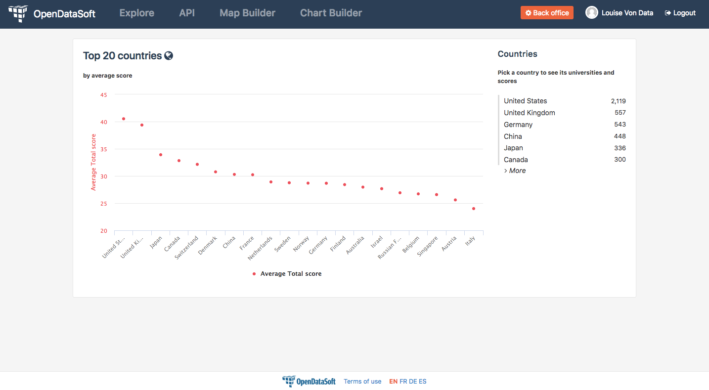

How to make visualizations match filters
========================================

.. role:: tutorial-keycap(emphasis)

.. rst-class:: header-information-tutorial

    ★★★ Advanced - time: 45 minutes

*This tutorial will teach you how to create different visualizations options to match related filters. This can be useful especially with charts, since they can sometimes become useless once related filters are activated. This tutorial will be fully customizable and reusable in any dashboard or piece of content created with HTML/CSS on OpenDataSoft.*

During this tutorial, you will learn:

- how to use the ``ng-if`` AngularJS directive
- when and how to use the ``context.parameters`` object inside the ``ng-if`` directive

.. rst-class:: block-prerequisite-congratulation

 **PREREQUISITES**

 - In order to test this tutorial and/or integrate the hide/show configuration on widgets in an already existing page, you need to have access to the back office of an OpenDataSoft portal and be granted the "Edit all pages" permission.
 - Since this tutorial is labeled as "Advanced" in terms of difficulty level, we assume that you already know HTML and CSS well enough to recognize and understand their structures and how they work. Other more technical elements will however be explained in details.
 - We highly recommend to follow the tutorial with the `Shanghai World University Ranking <https://data.opendatasoft.com/explore/dataset/shanghai-world-university-ranking%40public/>`_ dataset, used throughout the whole tutorial. If you however choose to follow the tutorial with another dataset, keep in mind that you will need to adapt each step.

.. HIDE ALL / SHOW ALL:

.. rst-class:: expand-collapse-items expand-all expand-collapse-item-active

    Show all images

.. rst-class:: expand-collapse-items collapse-all

    Hide all images

.. PART 1 - CREATE THE BASE, FIND THE PROBLEM:

.. rst-class:: title-level-2

    Create the base

In this tutorial, we will create a page comprised of a visualization and its related dataset filter, using the `Shanghai World University Ranking <https://data.opendatasoft.com/explore/dataset/shanghai-world-university-ranking%40public/>`_ dataset that can be found on our OpenDataSoft data network.

.. rst-class:: block-step

    1 + Let's start our page by adding the widget code of the visualization of our choice. Here, we chose to display a scatter plot chart representing the top 20 of the best universities in the ranking. For each university, the chart shows their average score.

.. admonition:: Note
   :class: note

   Depending on whether you try this tutorial on a new page or in an existing dashboard, you will perhaps see the ``
`` and ``
`` tags: both are default tags that create the default frame of any OpenDataSoft page. If you want to keep this frame, make sure to add the code of the tutorial between these default tags.

.. code-block:: html

 

    

     <ods-dataset-context context="shanghaiworlduniversityrankingpublic" shanghaiworlduniversityrankingpublic-dataset="shanghai-world-university-ranking@public" shanghaiworlduniversityrankingpublic-parameters="{'sort':'world_rank'}">
     <ods-chart align-month="true">
        <ods-chart-query context="shanghaiworlduniversityrankingpublic" field-x="country" maxpoints="20" sort="serie1-1">
            <ods-chart-serie expression-y="total_score" chart-type="scatter" function-y="AVG" color="#FF515A" scientific-display="true">
            </ods-chart-serie>
        </ods-chart-query>
     </ods-chart>
     </ods-dataset-context>

    

 

.. rst-class:: img-hide

    SCREENSHOT

.. rst-class:: block-step

    2 + Before going any further, declare the unique context of your page, using the `odsDatasetContext <https://help.opendatasoft.com/widgets/#/api/ods-widgets.directive:odsDatasetContext>`_ widget. This will allow our widgets to interact with one another -and it always is the proper way to build a dashboard.

.. admonition:: Important
   :class: important

   Don't forget to delete the ``ods-dataset-context`` tag above the code of the chart widget. Also, replace the current context name (here, ``shanghaiworlduniversityrankingpublic``) by the new one (here, ``worlduniversityranking``).

.. code-block:: html

 <ods-dataset-context context="worlduniversityranking"
                      worlduniversityranking-dataset="shanghai-world-university-ranking@public">

 

    

     <ods-chart align-month="true">
        <ods-chart-query context="worlduniversityranking" field-x="country" maxpoints="20" sort="serie1-1">
            <ods-chart-serie expression-y="total_score" chart-type="scatter" function-y="AVG" color="#FF515A" scientific-display="true">
            </ods-chart-serie>
        </ods-chart-query>
     </ods-chart>

    

 

 </ods-dataset-context>

.. rst-class:: img-hide

    SCREENSHOT

.. rst-class:: block-step

    3 + Add a filter related to the chosen dataset, using the `odsFacets <https://help.opendatasoft.com/widgets/#/api/ods-widgets.directive:odsFacets>`_ widget. Here, we retrieve the Country filter that already is an existing facet on the dataset published on Data.

.. code-block:: html

 <ods-dataset-context context="worlduniversityranking"
                      worlduniversityranking-dataset="shanghai-world-university-ranking@public">

 

    

     <ods-chart align-month="true">
        <ods-chart-query context="worlduniversityranking" field-x="country" maxpoints="20" sort="serie1-1">
            <ods-chart-serie expression-y="total_score" chart-type="scatter" function-y="AVG" color="#FF515A" scientific-display="true">
            </ods-chart-serie>
        </ods-chart-query>
     </ods-chart>

    <ods-facets context="worlduniversityranking">
      <ods-facet name="country"></ods-facet>
    </ods-facets>

    

 

 </ods-dataset-context>

.. rst-class:: img-hide

    SCREENSHOT

.. rst-class:: block-step

    4 + Click on :tutorial-keycap:`Preview`. Technically, everything works well: the chart indeed updates according to the chosen filter option. However, the filtered chart becomes completely useless, because it only displays one only point.

.. rst-class:: img-hide

    SCREENSHOT

We need a second option visualization, that will only be displayed in case the filter is used. This second option visualization will replace the default, unfiltered chart that becomes useless once filtered. Let's do this!

.. PART 2 - 2ND OPTION VISUALIZATION WITH ANGULARJS:

.. rst-class:: title-level-2

    Add a 2nd option visualization, with AngularJS

.. rst-class:: block-step

    5 + Before diving into AngularJS directives and expressions, let's add the widget code of our 2nd option visualization, right below the first one. Here, we chose to display a column chart representing the top 10 of the best universities in the ranking. For each university, the chart shows their average score. Keep in mind that this chart will only be displayed when the filter is used, meaning that the new 2nd option chart will always show the top 10 universities per chosen country.

.. admonition:: Important
   :class: important

   Don't forget to clean the code and to replace the context name with the one we declared earlier (see step 2).

.. code-block:: html

 <ods-dataset-context context="worlduniversityranking"
                      worlduniversityranking-dataset="shanghai-world-university-ranking@public">

 

    

     <ods-chart align-month="true">
        <ods-chart-query context="worlduniversityranking" field-x="country" maxpoints="20" sort="serie1-1">
            <ods-chart-serie expression-y="total_score" chart-type="scatter" function-y="AVG" color="#FF515A" scientific-display="true">
            </ods-chart-serie>
        </ods-chart-query>
     </ods-chart>

    <ods-chart align-month="true">
        <ods-chart-query context="worlduniversityranking" field-x="university_name" maxpoints="10" sort="serie1-1">
            <ods-chart-serie expression-y="total_score" chart-type="column" function-y="AVG" color="#FCD23B" scientific-display="true">
            </ods-chart-serie>
        </ods-chart-query>
    </ods-chart>

    <ods-facets context="worlduniversityranking">
      <ods-facet name="country"></ods-facet>
    </ods-facets>

    

 

 </ods-dataset-context>

.. rst-class:: img-hide

    SCREENSHOT

.. rst-class:: block-step

    6 + Now is the time to tackle AngularJS! We will need to add an AngularJS directive to both visualizations: the default one (that should NOT be displayed if the filter is used) and the 2nd option chart (that should ONLY be displayed if the filter is used). Since any AngularJS directive must be added into an HTML tag, and seeing our code, the best way to do in order to keep our code clean is to add ``div`` tags. Wrap each chart between ``div`` tags.

.. code-block:: html

 <ods-dataset-context context="worlduniversityranking"
                      worlduniversityranking-dataset="shanghai-world-university-ranking@public">

 

    

     

     <ods-chart align-month="true">
        <ods-chart-query context="worlduniversityranking" field-x="country" maxpoints="20" sort="serie1-1">
            <ods-chart-serie expression-y="total_score" chart-type="scatter" function-y="AVG" color="#FF515A" scientific-display="true">
            </ods-chart-serie>
        </ods-chart-query>
     </ods-chart>
     

    

    <ods-chart align-month="true">
        <ods-chart-query context="worlduniversityranking" field-x="university_name" maxpoints="10" sort="serie1-1">
            <ods-chart-serie expression-y="total_score" chart-type="column" function-y="AVG" color="#FCD23B" scientific-display="true">
            </ods-chart-serie>
        </ods-chart-query>
    </ods-chart>
    

    <ods-facets context="worlduniversityranking">
      <ods-facet name="country"></ods-facet>
    </ods-facets>

    

 

 </ods-dataset-context>

.. rst-class:: img-hide

    SCREENSHOT

.. rst-class:: block-step

    7 + We now have a perfect place to write our AngularJS directives! Let's start with the 2nd option chart, the one that must only be displayed if the filter is used. To do so, we need to use the ``ng-if`` AngularJS directive. The ``ng-if`` directive is a conditional expression that determines whether an HTML element should be displayed or not.

Let's take a look at the syntax of the expression we are going to use.

.. code-block:: javascript

 ng-if="mycontext.parameters['refine.field_ID']"

``ng-if`` is the AngularJS directive. It is always followed by an equals sign ``=`` which indicates that what comes after is an expression. This expression will be evaluated by the directive, and it must always be written between double quotes ``"``.

``mycontext.parameters`` can be seen as an object which contains a list of context-related parameters that act as filters. The list of parameters must be written between brackets ``[]``, and each separate parameter must be written between simple quotes``'``. For this tutorial, since it is the use of the ``Country`` filter that will determine which chart visualization option should be displayed, we need the ``mycontext.parameters`` object to use the filter parameter in our ``ng-if`` expression. ``mycontext`` must be replaced by the name of the page context.

- ``refine`` indicates that we use a filter parameter.
- ``.field_ID`` allows us to precise which specific filter we are going to use. ``field_ID`` must be replaced by the technical identifier of the field that is used as filter.

Basically, the ``ng-if`` syntax could be read as such: "If ``mycontext`` is filtered with ``field_ID``, [display the related HTML elements]".

.. rst-class:: block-step

    8 + Add the ``ng-if`` directive into the ``div`` tag wrapping the 2nd option chart. Don't forget to replace ``mycontext`` by the name of page context (see step 2) and ``field_ID`` by the technical identifier of the dataset field that we use as filter (see step 3). In this tutorial, ``mycontext`` is replaced by ``worlduniversityranking`` and ``field_ID`` is replaced by ``country``.

.. code-block:: html

 <ods-dataset-context context="worlduniversityranking"
                      worlduniversityranking-dataset="shanghai-world-university-ranking@public">

 

    

     

     <ods-chart align-month="true">
        <ods-chart-query context="worlduniversityranking" field-x="country" maxpoints="20" sort="serie1-1">
            <ods-chart-serie expression-y="total_score" chart-type="scatter" function-y="AVG" color="#FF515A" scientific-display="true">
            </ods-chart-serie>
        </ods-chart-query>
     </ods-chart>
     

    

    <ods-chart align-month="true">
        <ods-chart-query context="worlduniversityranking" field-x="university_name" maxpoints="10" sort="serie1-1">
            <ods-chart-serie expression-y="total_score" chart-type="column" function-y="AVG" color="#FCD23B" scientific-display="true">
            </ods-chart-serie>
        </ods-chart-query>
    </ods-chart>
    

    <ods-facets context="worlduniversityranking">
      <ods-facet name="country"></ods-facet>
    </ods-facets>

    

 

 </ods-dataset-context>

.. rst-class:: img-hide

    SCREENSHOT

.. rst-class:: block-step

    9 + Click on :tutorial-keycap:`Preview`: by default, our 2nd option chart is hidden. But when the filter is used, the chart appears!

.. rst-class:: img-hide

    SCREENSHOT

.. rst-class:: block-step

    10 + It's time to make the default chart disappear when the filter is used (and the 2nd option chart is displayed)! Basically, we want this expression to do the exact opposite of what the previous did. The good news is: there is a way to do so, that doesn't require the rewriting of a whole new expression. All we need is to reuse our previous expression, and add one single character at the beginning of it: an exclamation mark ``!``.

.. code-block:: javascript

 ng-if="! mycontext.parameters['refine.field_ID']"

An exclamation mark ``!``, placed at the beginning of an expression, reverses its behaviour. Basically, this expression could be read: "If ``mycontext`` is filtered with ``field_ID``, [DO NOT display the related HTML elements]".

.. rst-class:: block-step

    11 + Add the ``ng-if`` directive into the ``div`` tag wrapping the first, default chart. Don't forget to replace ``mycontext`` and ``field_ID`` as in the previous expression (see step 8).

.. admonition:: Note
   :class: note

   You can also copy the previous ``ng-if`` directive with its expression, and add a ``!`` at the beginning.

.. code-block:: html

 <ods-dataset-context context="worlduniversityranking"
                      worlduniversityranking-dataset="shanghai-world-university-ranking@public">

 

    

     

     <ods-chart align-month="true">
        <ods-chart-query context="worlduniversityranking" field-x="country" maxpoints="20" sort="serie1-1">
            <ods-chart-serie expression-y="total_score" chart-type="scatter" function-y="AVG" color="#FF515A" scientific-display="true">
            </ods-chart-serie>
        </ods-chart-query>
     </ods-chart>
     

    

    <ods-chart align-month="true">
        <ods-chart-query context="worlduniversityranking" field-x="university_name" maxpoints="10" sort="serie1-1">
            <ods-chart-serie expression-y="total_score" chart-type="column" function-y="AVG" color="#FCD23B" scientific-display="true">
            </ods-chart-serie>
        </ods-chart-query>
    </ods-chart>
    

    <ods-facets context="worlduniversityranking">
      <ods-facet name="country"></ods-facet>
    </ods-facets>

    

 

 </ods-dataset-context>

.. rst-class:: img-hide

    SCREENSHOT

.. rst-class:: block-step

    12 + Click on :tutorial-keycap:`Preview`: it all works perfectly!

.. rst-class:: img-hide

    SCREENSHOT

.. PART 3 - FINISHING TOUCHES:

.. rst-class:: title-level-2

    Add the finishing touches

.. rst-class:: block-step

    13 + At this point, the only thing left to do is to make the page prettier! Let's organize our HTML elements using Bootstap. For this tutorial, we are going to use a single row, that will be split in 2: the visualization will be on the left while the the filter will be displayed on the right. Considering the size of a visualization compared of that of a list of filters, we will use 9 columns for the visualization and 3 for the filters.

.. admonition:: Important
   :class: important

   If you are not familiar with Bootstrap and how it allows to organize a web page, check our :doc:`"How to build a dashboard (part 2)" tutorial </dashboard/how_to_build_dashboard_part2>` (section "Format your dashboard: organize your widgets in rows and columns").

.. code-block:: html

 <ods-dataset-context context="worlduniversityranking"
                      worlduniversityranking-dataset="shanghai-world-university-ranking@public">

 

    

    

      

     

     <ods-chart align-month="true">
        <ods-chart-query context="worlduniversityranking" field-x="country" maxpoints="20" sort="serie1-1">
            <ods-chart-serie expression-y="total_score" chart-type="scatter" function-y="AVG" color="#FF515A" scientific-display="true">
            </ods-chart-serie>
        </ods-chart-query>
     </ods-chart>
     

    

    <ods-chart align-month="true">
        <ods-chart-query context="worlduniversityranking" field-x="university_name" maxpoints="10" sort="serie1-1">
            <ods-chart-serie expression-y="total_score" chart-type="column" function-y="AVG" color="#FCD23B" scientific-display="true">
            </ods-chart-serie>
        </ods-chart-query>
    </ods-chart>
    

       

      

    <ods-facets context="worlduniversityranking">
      <ods-facet name="country"></ods-facet>
    </ods-facets>
       

    

    

 

 </ods-dataset-context>

.. rst-class:: img-hide

    SCREENSHOT

.. rst-class:: block-step

    14 + And finally, let's add titles and textual indications, to make sure that everyone understands how the page and its content work.

.. code-block:: html

 <ods-dataset-context context="worlduniversityranking"
                      worlduniversityranking-dataset="shanghai-world-university-ranking@public">

 

    

    

      

     

     <h2>
         Top 20 countries <i class="fa fa-globe" aria-hidden="true"></i>
     </h2>
     <h5>
         by average score
     </h5>
     <ods-chart align-month="true">
        <ods-chart-query context="worlduniversityranking" field-x="country" maxpoints="20" sort="serie1-1">
            <ods-chart-serie expression-y="total_score" chart-type="scatter" function-y="AVG" color="#FF515A" scientific-display="true">
            </ods-chart-serie>
        </ods-chart-query>
     </ods-chart>
     

    

    <h2>
        Top 10 university <i class="fa fa-university" aria-hidden="true"></i>
    </h2>
    <h5>
        by average score
    </h5>
    <ods-chart align-month="true">
        <ods-chart-query context="worlduniversityranking" field-x="university_name" maxpoints="10" sort="serie1-1">
            <ods-chart-serie expression-y="total_score" chart-type="column" function-y="AVG" color="#FCD23B" scientific-display="true">
            </ods-chart-serie>
        </ods-chart-query>
    </ods-chart>
    

       

      

      <h3>
          Countries
      </h3>
      <h5>
          Pick a country to see its universities and scores
      </h5>
    <ods-facets context="worlduniversityranking">
      <ods-facet name="country"></ods-facet>
    </ods-facets>
       

    

    

 

 </ods-dataset-context>

.. rst-class:: img-hide

    SCREENSHOT

.. rst-class:: block-prerequisite-congratulation

 **CONGRATULATIONS!**

 You have finished this tutorial and you now know how to create different visualizations options to make sure they match the filters of the page. And hopefully your now feel comfortable enough with the combination of ``ng-if`` and ``context.parameters`` to be able to use it again on your own!
